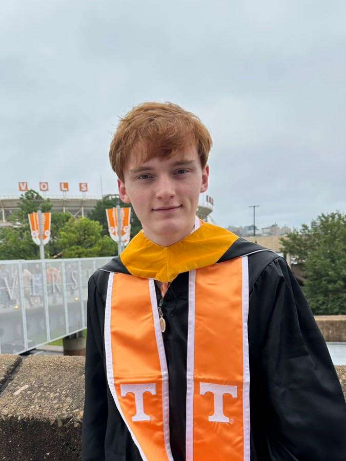

My name is Adam McDaniel. <a href="https://adam-mcdaniel.github.io/">I'm a red-headed musician, programmer, and PhD student at the University of Tennessee, Knoxville</a>. I'm a Knoxville native — born and raised! I love mexican food, tea, the Beatles, and my favorite color is
 <i style="color: #7F00FF; display: inline;">purple</i>.

 
<table style="width:60%"><tr><td></td></tr><tr><td style="text-align: center; vertical-align: middle;"><b>Me🧑‍🦰</b></td></tr></table>

## Education

I started college at the University of Tennessee in fall of 2020, and graduated with my Bachelor's degree in December of 2022. I also finished up my Master's degree in May of 2024. Currently I'm a graduate student pursuing a PhD.

## Hobbies

Here are a few of my hobbies, some of which I explore in more detail below:

- **Programming👨‍💻**: I spend more time writing software than practically anything else. I love making programming languages, compilers, shells, text editors, board games, and operating systems.
- **Music🎶**: I love to play guitar and sing! I can also play the harmonica with my guitar. Additionally, I took 7 years of piano lessons, but I can only play a few good songs now.
- **Linguistics📚**: I'm fascinated by languages and how they evolve. I'm fluent in Spanish!
- **Chess♟️**: I play a good amount of chess, and I've written my own chess engine. I'm a big fan of the game, and I love to play against others. It's an incredibly elegant game.
- **Catan🏡**: I love to play Catan with my friends. I've played hundreds of games, and I've won more than my fair share. It's definitely one of my favorite board games.
- **Reading📖**: I love to read! Dune, A Farewell to Arms, El Árbol de la Ciencia, the Book of Revelation, and the Book of Daniel are among my favorites!
- **Philosophy💭**: I love to learn more about philosophy. Plato is certainly my favorite—there's something very comforting about our world being a shadow of some abstract world of forms.
- **Hiking⛰️**: I love to hike! I've hiked Mount LeConte and many other of the surrounding mountains in the Smokeys. My longest hike was 18.2 miles in one day! I ate a whole pizza and several bags of candy to recover!
- **Writing📝**: I love to write, which is why I started this blog! It's a nice, low pressure way to get my thoughts out there.

## Programming

Python was my first programming language, but I'm a Rustacean🦀 at heart.

I started programming in middle school during the 7th grade. At first, I was fascinated with making games. I wrote some terrible ones using Pygame. Some of them used sockets to implement multiplayer functionality as well. In high school I joined the FIRST robotics competition team my freshman year, and continued through my senior year. We used Python to write our robot code. During my sophomore year, I became enthralled with the concept of different programming paradigms and programming language design. During my junior year, I implemented a functional programming language named [Maroon](https://github.com/adam-mcdaniel/maroon). I also wrote several other toy languages at the time, including [Tsar](https://github.com/adam-mcdaniel/tsar) which is a dynamically typed, ahead of time compiled language which could transpile to both Rust and Go backends.

My best projects by far are [Dune](https://github.com/adam-mcdaniel/dune) and [Sage](https://github.com/adam-mcdaniel/sage), a shell and a compiler respectively.

## Music

I've played guitar since 2016, and I play often. I love the Beatles, the Rolling Stones, Pink Floyd, Jimi Hendrix, Bob Dylan, the Temptations, and Aphrodite's Child. Anything somewhat bluesy or psychedelic is right up my alley. In particular, [666 by Aphrodite's Child](https://open.spotify.com/album/2lWDphDAlgk8PNdODreJwv?si=_SmyNGqiRyyl6ib1HxcKoA) has likely been my favorite album throughout the past year.

    <video width="60%" controls>
        <source src="./media/junk.webm" type="video/webm">
        Your browser does not support the video tag.
    </video>

In my free time, you'll often find me playing guitar, especially when I should be doing something else. I've played and sang for several venues and audiences in the past, but I mainly play to entertain myself. [Click here to listen to more of my music endeavors!](https://adam-mcdaniel.github.io/music)

## Linguistics

I'm fluent enough in Spanish to enjoy books, shows, podcasts, and movies in the language. I try to practice at least an hour a day listening to Spanish content in some form or another. I hope to learn more languages in the future, but my stamina for Googling every word I don't know is growing thin!

I'm very interested in how languages are related to one another: it's fascinating to me how languages evolve. I'm also interested in constructed languages, like [Toki Pona](https://en.wikipedia.org/wiki/Toki_Pona). It's fun to assign spoken languages to different programming languages as well: Java is certainly Vulgar Latin, JavaScript is English, x86 is a Pidgin, and C is Classical Latin.

## Chess

My [lichess](https://lichess.org) account is [adamthekiwi](https://lichess.org/@/adamthekiwi). I like to say that my peak blitz chess rating was 2161 (quite literally a chess master rating), but it was out of sheer luck that three ~2000 rated players in a row resigned early when I first started.

I also wrote my own cross platform engine which runs anywhere. You can play against it right here in the browser!

<embed type="text/html" src="https://adam-mcdaniel.github.io/chess-engine/examples/chess-web/chess-best.html" width="420" height="420"/>