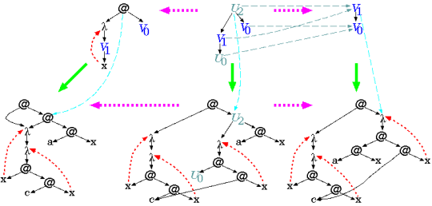

Over the past few months, I've been really excited about the implementation of functional programming languages. The reason I'm so excited about implementing them is because of this concept of **_combinators_**. Combinators are basically primitive lambda functions that are really simple but very powerful. There's something **_REALLY_** special about combinators though. Any lambda expression that can be written, no matter how complex, can be rewritten as applications of a **single** combinator. This means that any lambda calculus program can be compiled to a giant expression of single function calls which are really easy to interpret. You dont even need to write a crazy implementation of beta reduction seen below!

The most powerful part about combinator compilers, in my opinion, is the fact that their intermediate code is so portable. Combinator interpreters are so easy to write in any turing machine or lambda calculus based language. Compilers are a bit more complex, but still relatively simple. All you have to do is implement the combinators for your target language or architecture, and you're ready to compile!