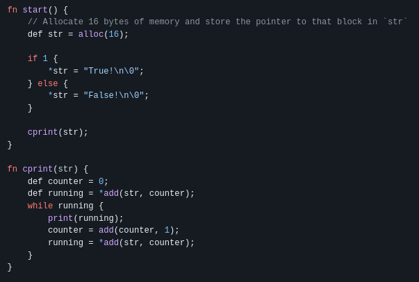

I've written an alternative to the C programming language. This is how it 
works, and what I've learned.

## Free

About 6 months ago, I began exploring compilers with [_extremely limited_](https://en.wikipedia.org/wiki/Turing_tarpit) target backends. I came across [the brain programming language](https://github.com/brain-lang/brain) and I was _immediately_ inspired. How could a high level programming language possibly use such a tiny backend? It was incredibly interesting to me, so I decided to write my own language, [free](https://github.com/adam-mcdaniel/free). It used a super-set of Brain**** with 3 new instructions for dynamic memory management. After a substantial amount of keyboard clacking and lots of confusion, I had accidentally made a working compiler! The end result looked like this:

I couldn't believed it worked; it was incredible. The only problem was that _**free was absolute garbage**_. It couldn't be used for anything. At all. There wasn't a type system, memory was basically impossible to manage, there wasn't any kind of IO other than STDIN and STDOUT, there was no error checking system of any kind, etc. I loved my creation, but it wasn't practical.

## Oak's Conception

Then, I had an idea. What if I kept the tape memory structure from Brain****, kept the memory management operations from free, and added some operators for managing a stack? The result was Oak's backend assembly language. After a week of experimenting, I created an incredibly reduced instruction set with only 12 operators that could output basic C code. _"This is perfect"_, I thought. I implemented an intermediate representation that implemented functions, structures, a type system, and basic operations that any programming language needs. I even added a foreign function interface, so that users could import C code into their programs! I was incredibly excited.

It was at about this point that the language took* off on Reddit, HackerNews, and GitHub. Only a _single day_ after posting the GitHub link to Reddit, I had over **_16,000_** unique visitors to the repository. I had never received much attention on Reddit or GitHub, so this was incredibly powerful to me. It fueled me to keep going.

At around this point, the project was still pretty barebones. It had all the basic necessities, but nothing more. There was still a _lot_ to be done. Oak was basically just a glorified, stripped down, and less robust C compiler.

## Typechecking is hard

Although I knew typechecking could get complicated, I didn't know it would take up about _half of my intermediate representation's codebase_. Typechecking isn't about confirming if a program is correct, it's about confirming a program **isn't** correct. Although that distinction might sound a bit unnecessary, I assure you it is not. Typechecking is difficult because you have to consider **every incorrect program possible**, and try to eliminate each one. It's almost impossible to get right, and there are probably dozens of logic errors in Oak's type system _right now_. _But_, in the end, it works pretty well. It's mostly just the fringe cases that are a bit off.

By far, the hardest part is typechecking the code responsible for automatic memory management. There are so many things that can go wrong, it's unbelievable how easy it is to screw up. One big problem I ran into was determining whether or not a structure _needed_ to use automatic memory management _at all_. Why use copy constructors and destructors for a type that doesn't have any members with copy constructors or destructors? And how do you confirm that all objects' destructors will be called? After some experimenting, I think I figured out an air tight solution, but honestly _I really don't know if there are ways to abuse the automatic memory management system_.
