## Index

1. [The Lighthouse Keeper](#the-lighthouse-keeper)
    a. [The Vessel Appears](#the-vessel-appears)
2. [The Compiler](#the-compiler)
    a. [My Journey](#my-journey)
    b. [The Platonic Ideal](#the-platonic-ideal)
3. [The Shell](#the-shell)
    a. [Atom](#atom)
    b. [Dune](#dune)
4. [The Text Editor](#the-text-editor)
    a. [The First Editor](#the-first-editor)
    b. [The Lite Text Editor](#the-lite-text-editor)
5. [The Wreckage Repaired](#the-wreckage-repaired)
6. [Conclusion](#conclusion)

## The Lighthouse Keeper

Ages ago, a lighthouse keeper tended to the light on a rocky Atlantic island. The lighthouse keeper was a lonely figure, spending his days in solitude, save for the seldom pulses from the signal lamps of passing ships delivering terse, perfunctory directives. The lighthouse was built upon a rugged outcrop, beset on all sides by the crashing waves of the Atlantic. The keeper had been stationed there by his superiors without say, and he had no choice but to obey.

He knew that the lighthouse was a vital beacon for the ships that passed by, and he took his duty seriously. Without his light, many ships would have been lost to the treacherous rocks below. His fathers before him had tended to the light: he spent his entire life thus far on forlorn isles such as this. All the same, he dreamed of a day where he might be free of his lonely vigil.

### The Vessel Appears

One night, a tempest swiftly raged across the Atlantic; not a ship dared to brave the storm. The lighthouse keeper tried to maintain the light, but the storm was too fierce. The wind wailed and the rain lashed against the tower. The very rocky foundation of the lighthouse trembled under the onslaught of the waves. Despite his best efforts, the light extinguished, and the keeper was plunged into the darkness.

Desperate, the keeper scrambled to rekindle the flame. He fumbled in the dark, searching for his flint and tinder. On the horizon, he saw the glimmering hue of a signal lamp: an impossible sight in the midst of the hurricane. The dim light flickered through the torrent, encoding a message for the keeper. Having tended to the light for so long, he recognized the flashes of the lamp as his own native tongue.

The message was clear: ***"Your duty is fulfilled. Find your true purpose. Build anew. Tend to the light within."***

The storm passed as quickly as it had come. In the morning, the keeper stepped out of the lighthouse, and found a small vessel driven upon the rocks by the tempest. The ship was mysteriously empty, and badly damaged, but the keeper saw potential in the wreckage. Scheming, he went back to the lighthouse and gathered his tools.

## The Compiler

The compiler is the first tool in the trifecta. Without it, the ship of software development could have no hull, no sails, no rudder.

### My Journey

I wrote my first compiler in my sophomore year of high-school, called "Lime". It was barely a compiler -- it simply transpiled a simple, bare-bones language into C. I was fascinated by the idea of writing a program that could write other programs. It became my dream to write my own language I could be proud of, *and so I hoisted me sails in search of treasure without a map, argh*!

#### The First Steps

From then on, I began to write many compilers and interpreters. I experimented with functional programming in my sophomore year of high-school, and [wrote an interpreted language based entirely on lambda calculus](https://github.com/adam-mcdaniel/maroon-lang) during my junior year. During my senior year of high-school, I finally created something that I could call a "real" compiler: [a C-like language with semi-automatic memory management](https://github.com/adam-mcdaniel/oakc), which compiled to a simple stack-based virtual machine, supporting just 14 instructions, capable of using foreign functions written in C. This compiler wasn't seaworthy by any means, but it was my first monumental step towards success.

#### The Final Steps

Finally, during undergrad, I created the last project I would ever begin as a teenager: [the Sage programming language](https://github.com/adam-mcdaniel/sage). It's a statically-typed language (***lest there be a type-error at runtime, and the machine be driven mad upon the rocks!***) with generic algebraic data types, pattern matching, structural typing, mutability semantics, and a powerful intermediate representation plus virtual machine with SIMD support.

The language is powerful enough to implement a shell and powerpoint presentation app for my custom operating system, [SageOS](https://github.com/adam-mcdaniel/sage-os), but it's also simple enough to compile and execute in the browser. You can try it out below:

    

    <embed type="text/html" src="https://adam-mcdaniel.github.io/sage/sage/web/index.html" title="Compiler" width="100%" height="940em"></embed>

***Type in the source code box above and press the "Compile" button to see Sage in action.***

Sage is a culmination of years of effort, encapsulating over 25,000 lines of Rust and tens of thousands of lines of Sage code written for fun and testing. It represents my relentless pursuit of the ideal programming language—a journey filled with challenges, discoveries, and relentless coding marathons.

### The Platonic Ideal

Throughout my journey, I set out to find *my* perfect language, *my* perfect type system, *my* perfect syntax. I never really found it. I found that my perfect language is *just* beyond reach, but as I wrote more compilers, I learned some features of the Platonic ideal of a language that I could not live without.

All programming languages, here in the muck on Earth, are some poor approximation of the ideal language that only exists above in the abstract. But that doesn't mean we can't adopt some of the features of that ideal tongue.

In my time writing compilers, I've come to the conclusion that the following features are essential to any language that I would consider using:

- **Algebraic Data Types**: The Platonic ideal of all programming languages has sum types. Error handling in the sky is not done with exceptions, but with `Result` values which may contain either a success value or an error value.
- **First-Class Functions**: Functions should be as flexible as any other kind of data.
- **Immutability First**: Mutation is the root of all evil. Mutable state is a curse we must bear in our low, Earthly languages, but we can mitigate this curse by confining it where possible.

## The Shell

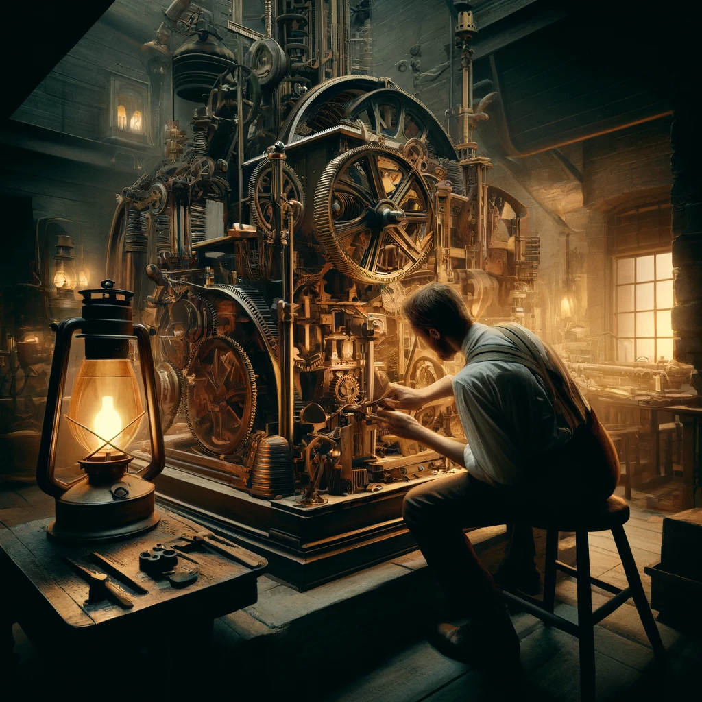

The shell is the second tool in the trifecta. Without the shell, the captain could not steer the ship, nor could the crew receive orders. Only with the shell can the ship be navigated through the treacherous waters of software development.

### Atom

I didn't write my first shell until the beginning of my freshman year of college. The shell was called [Atom](https://github.com/adam-mcdaniel/atom). It was designed with scripting power in mind, combining the best features of Python and Bash. It was powerful enough to implement a rather fun Gin-Rummy game in the shell script.

    

        <a href="https://asciinema.org/a/383254">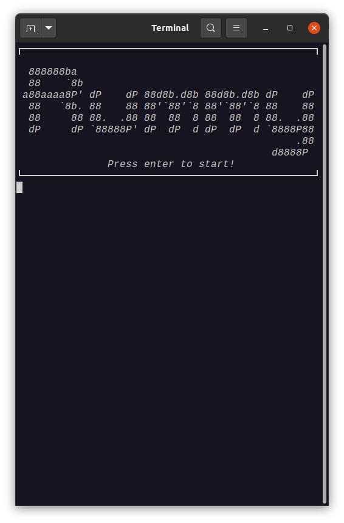</a>
        <a href="https://asciinema.org/a/383254">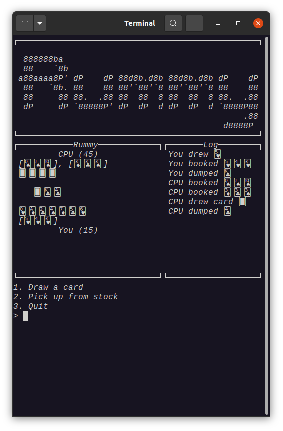</a>
    

*Click the images above to watch a demo of the Gin-Rummy game in Atom.*

However, the interface was clunky — the scripting support and interactivity were at odds with each other. *Avast ye!* I quickly learned that a shell should prioritize the command-line interface above all else, and that scripting should be a secondary concern.

### Dune

With this in mind, towards the end of my freshman year I renewed an older shell I'd created before Atom, called [Dune](https://github.com/adam-mcdaniel/dune). This shell is one of the best and most useful pieces of software I've written. It's my daily driver shell on all my personal and work machines: I use it almost every day.

Firstly, Dune is a right fair beauty! I love how the shell looks and feels to use. It has several built-in libraries and nice, expressive syntax.

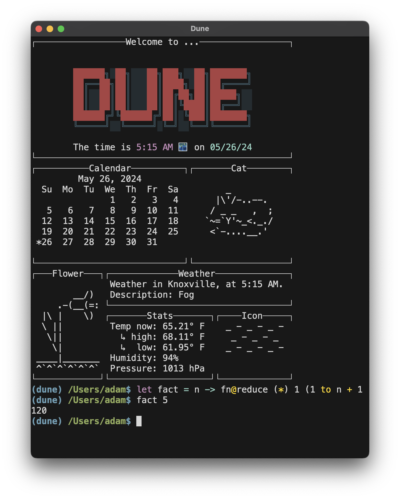

Dune also has a great interface for viewing tables and manipulating data in a Lisp-like manner. Here's an example of how you can use it for conveniently scraping and accessing data from a REST API.

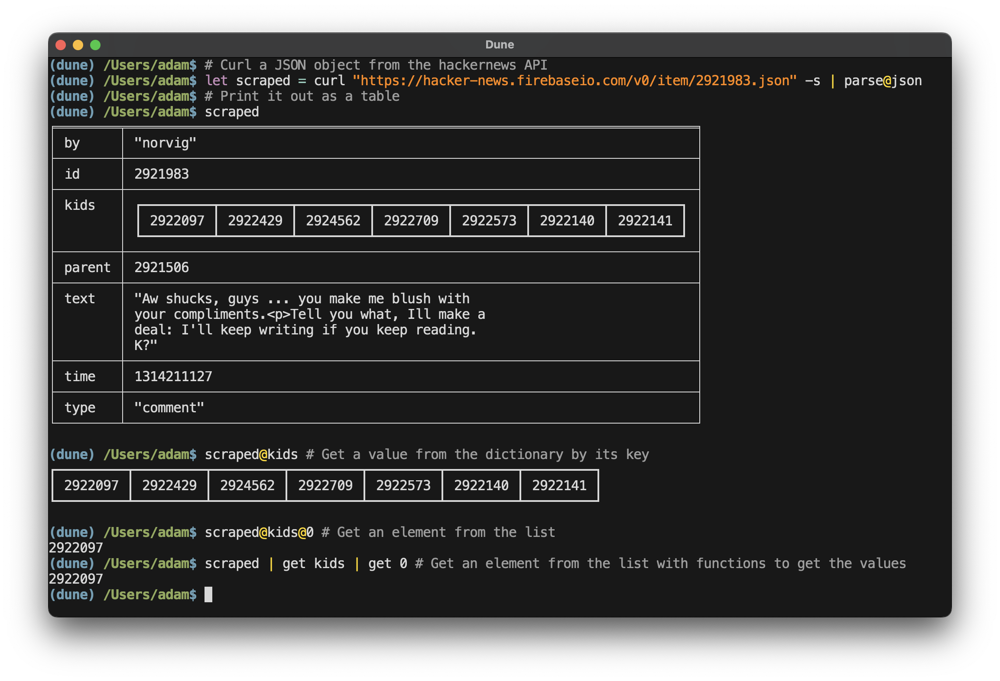

Dune's scripting language isn't as powerful as Atom's, but it's significantly more ergonomic than Bash. My start-up script for Dune scrapes the web for the weather, calculates the current Gregorian calendar, and displays a few other widgets with random ASCII art cats and flowers, all entirely in Dune-script.

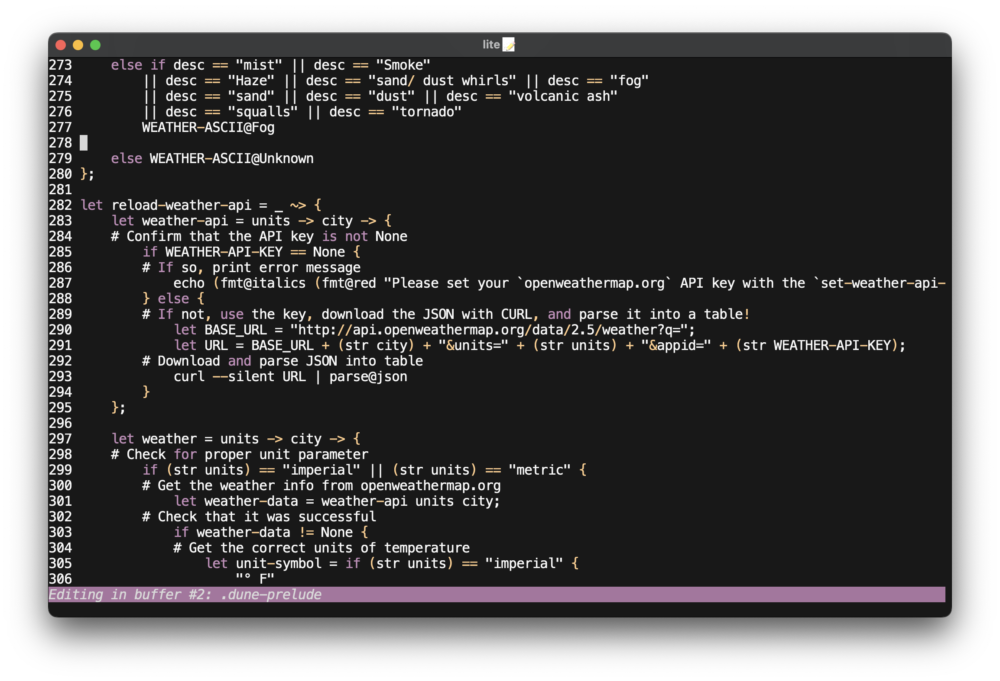

Of all the projects discussed in this article, Dune is the most useful and impactful software I've written. It's transformed my daily workflow and made my coding life more efficient and enjoyable.

## The Text Editor

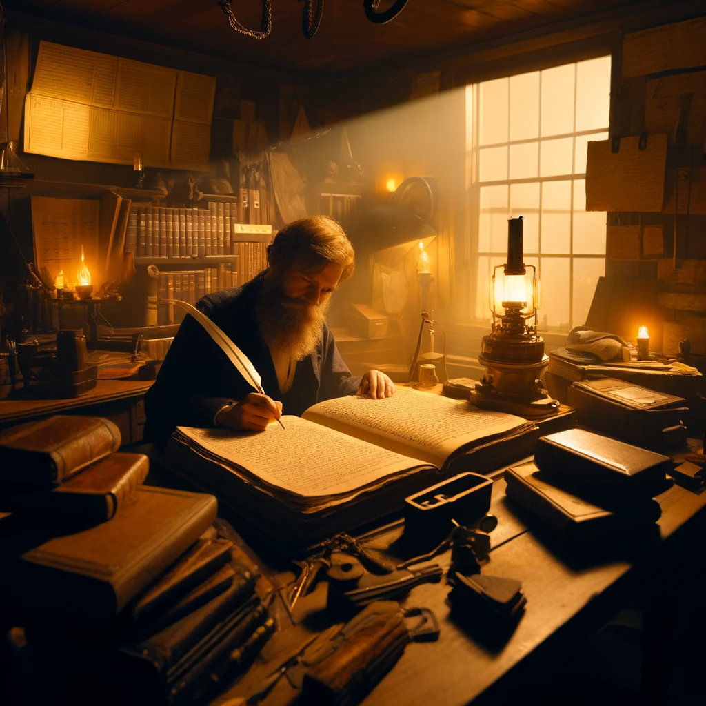

The text editor is the final tool in the trifecta. Without the text editor, the ship could not be modified or repaired. The text editor is the shipwright's workshop, the navigator's chart, the captain's log.

### The First Editor

My first text editor was a simple one I wrote in Rust during my senior year of high-school. It was merely called "Editor" as a temporary name, but I never got around to renaming it before I moved on to other projects. It was a simple text editor with syntax highlighting and a few other features. I never used it to write anything substantial, but it taught me a lot about how text editors work (and how difficult they are to write).

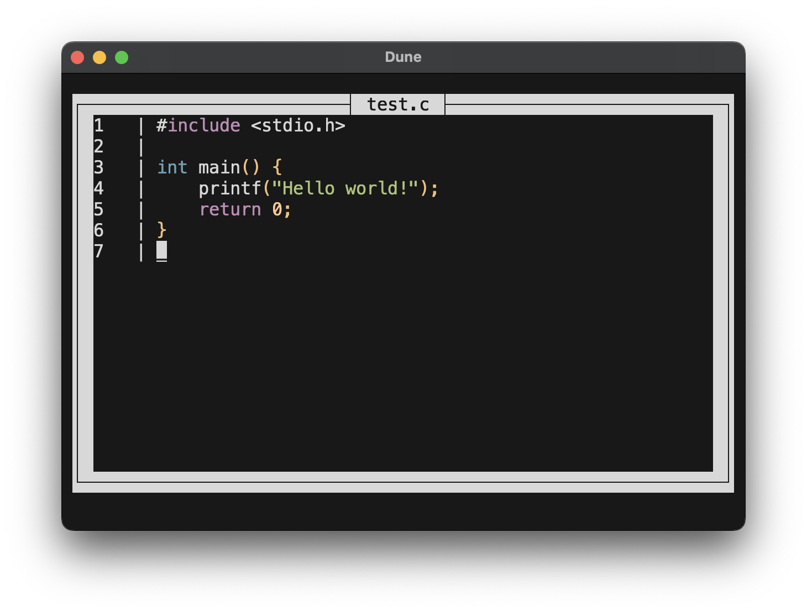

### The Lite Text Editor

During the summer before my senior year of college, I started work on a toy editor which would come to be known as [Lite](https://github.com/adam-mcdaniel/lite). After a few months of work, I moved on to other projects, but I had already put a substantial amount of work into it.

It's a simple text editor with a few good features: syntax highlighting, undo/redo support, intuitive keybindings, and a simple scripting language for extending the editor. While it's not a replacement for heavyweights like NeoVim, Emacs, or VSCode, it serves its purpose well and taught me a great deal about the intricacies of text editors.

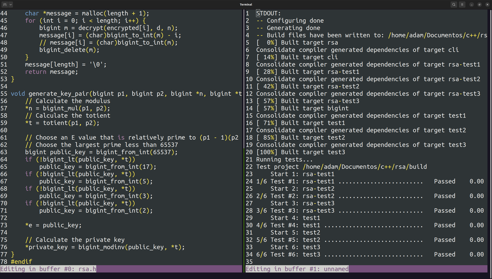

Lite is written in Rust, and its scripting language is a simple Lisp-like language. Here's an example of using script commands in the editor to manipulate the text buffer:

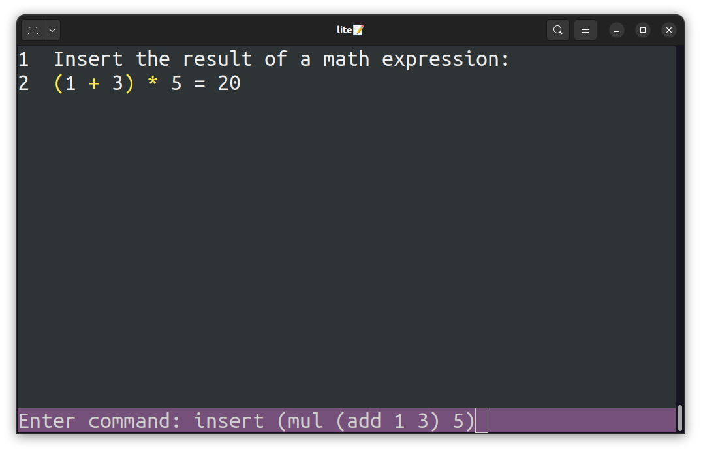

Here's the bare-bones configuration file I use for my lite editor. It merely sets up a new buffer on startup containing an introduction message, and adds a command for duplicating the current selection down one line.

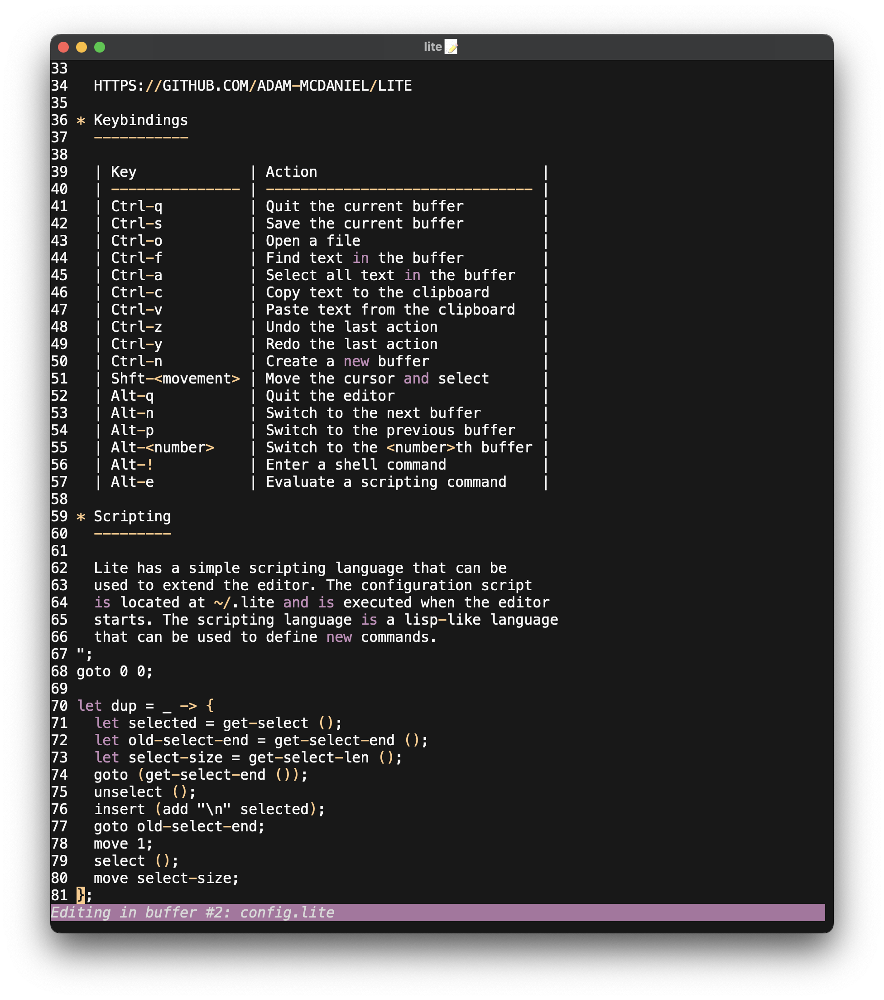

## The Wreckage Repaired

The lighthouse keeper worked tirelessly on the shipwreck, and after many months of labor, he had transformed the wreckage into a new vessel. The ship was a marvel to behold: a sleek, fast sloop with a hull of ironwood and sails of silk.

By his own hands, the lighthouse keeper had produced a ship that was more than the sum of its nails, planks, and sails. The vessel had become more than a mere instrument; above all else the ship was a work of art.

The lighthouse keeper boarded the craft, and gazed back at his stark, secluded lighthouse. He wouldn't be taking orders from distant signal lamps any longer, instead delivering them himself. The keeper pulled up the anchor, unfurled his sails, and watched the lighthouse begin to withdraw as the ship was carried by the wind.

The keeper's journey had only just begun: now, he would need to find companions with whom to share his vessel and voyage.

---

## Conclusion

In this article, I've recounted my journey writing a compiler, shell, and text editor: the trifecta of software development tools. These tools are the foundation of my work as a programmer, and I've poured countless hours into their creation and refinement.

I've learned many lessons along the way, and I've grown as a programmer and as a person. I've discovered the joy of creating something new, the satisfaction of solving difficult problems, and the thrill of exploring uncharted territory.

I hope my work inspires others to leave their lighthouses behind and set sail on their own journeys of discovery. Since I was a kid, I worked tirelessly in my room tending to projects and repositories as I'd been directed by others, using the tools I'd been given. I dreamed of a day where someone else might use the tools *I'd* built, just as I'd used the tools of others.

If you like my work, consider checking out [my website](https://adam-mcdaniel.net), [GitHub profile](https://github.com/adam-mcdaniel/), [my other articles](https://adam-mcdaniel.net/blog/), or [my music](https://adam-mcdaniel.net/music/). I'm always working on something new, and I'd love to have you in my crew!